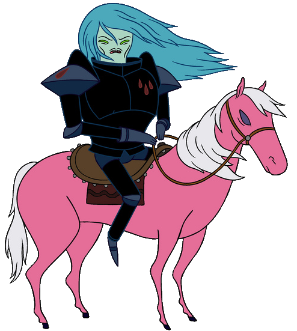

## a Python utility to slice a picture into a tilset

very rough around the edges but could be useful.

for now there's no CLI arguments so you need to edit main.py main() manually:

```
main("<image to slice>", "<dest folder name>", {"format":"png|jpg" [, "quality":80] } )
```

then run it
```
python slicer.py
```
it will produce a folder called `<dest folder name>` containing the tiles and an index.html file to test it right away.

## [demo page](https://www.barradeau.com/dump/sir-slicer/)

it should handle very large images but may be limited to 1 gigapixel ([opencv's default](https://github.com/opencv/opencv/blob/8eba3c1e7e8975ff1d263a41a5753efaa51d54fc/modules/imgcodecs/src/loadsave.cpp#L65)) 

the index uses [leaflet.js](https://leafletjs.com/), sir slicer image comes from the [adventure time Wiki](https://adventuretime.fandom.com/wiki/Sir_Slicer)

there's also a `tiler.py` utility that builds a big image given a folder of images. use at your own risks :)
